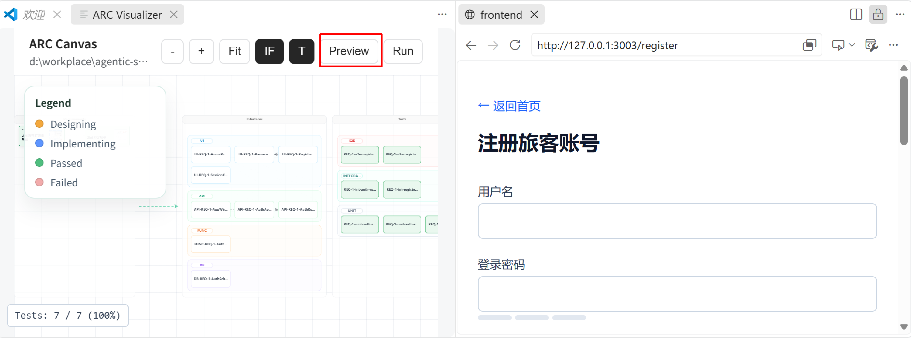
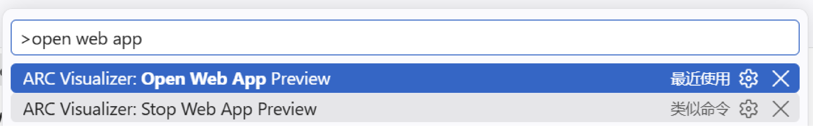
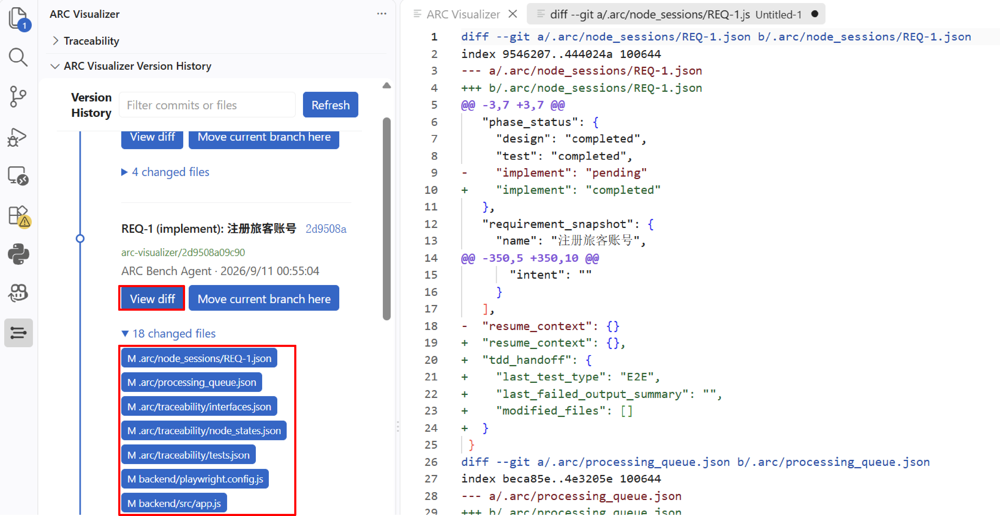
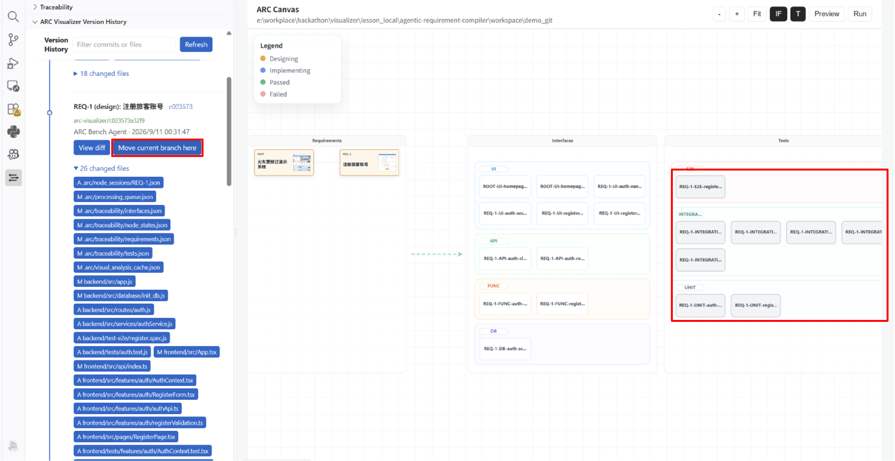

# Lab 5: Version Rewind and View Switching

  <a href="./README.md">中文</a> |
  <a href="./README_en.md">English</a>

This lab introduces two auxiliary features of ARC Visualizer: page preview and version rewind. You will use a precompiled example project to practice viewing historical versions, comparing code differences, and moving the current branch to a specified version.

## Lab Content

This lab contains two parts:

- **Page Preview and View Switching**: Start or stop the generated application's Web Preview in ARC Visualizer.
- **Version Rewind**: View past versions in the version history, compare the Diff between versions, and move the current branch to a specified version.

### Lab Materials

This lab continues the environment and workflow from Lab04. The Lab05 directory also provides [`demo_git.zip`](./demo_git.zip), which contains a precompiled example project for practicing version management and version rewind.

Before starting the lab, extract the archive and open the corresponding lab workspace in VS Code according to the instructions in Lab04.

## Lab Steps

### 1. Page Preview and View Switching

After the ARC run finishes, click **Preview** on Canvas to preview the generated Web application.

You can also open the Preview through the Command Palette:

1. Open the VS Code Command Palette.
2. Run `Open Web App Preview`.
3. Inspect the Web application in the Preview interface opened on the right.

To close the Preview manually, run `Stop Web App Preview` in the Command Palette.

### 2. View Historical Versions and Diff

Open **ARC Visualizer Version History** in the sidebar. Select a past version in the version history to:

- Preview the project state corresponding to that version;
- View the Diff between that version and other versions;
- Understand how requirements, code, and other generated results changed between versions.

### 3. Rewind to a Specified Version

To continue making changes based on a historical version, click **Move current branch here** on the specified version to move the current branch to that version.

After the switch is complete, you can continue adjusting the code from this intermediate version. Version rewind changes the current branch pointer, so it is recommended that you finish viewing the historical versions and comparing their Diff before performing this operation.

## Key Points

- Viewing historical versions or Diff is for inspection only and does not change the current branch.
- **Move current branch here** moves the current branch to the selected version. Any subsequent changes are based on that version.
- At the end of the lab, confirm that Preview, Canvas, and the version history currently open all correspond to the same workspace and version.

