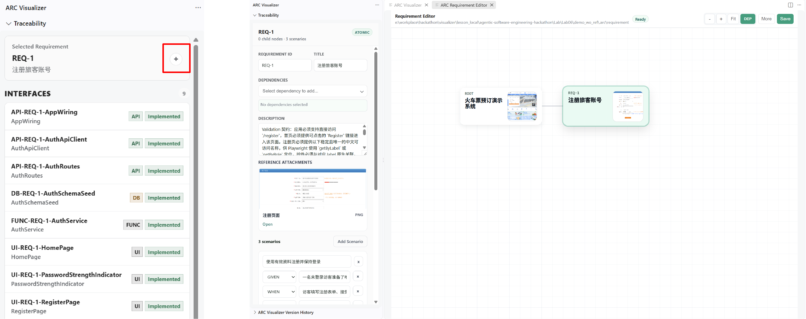
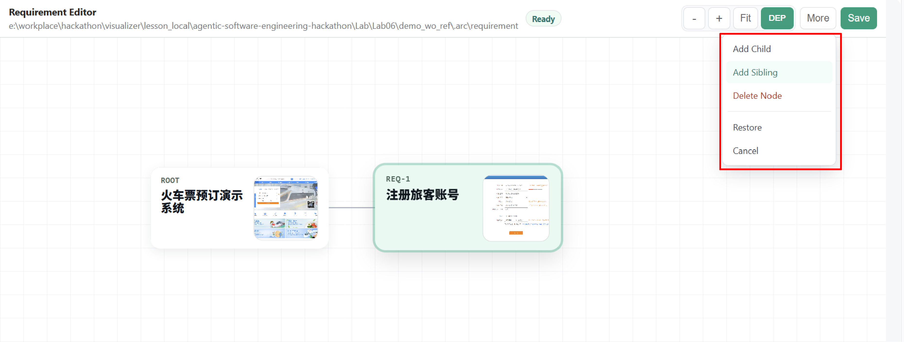
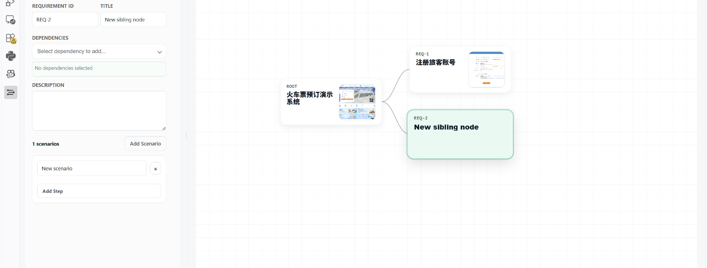
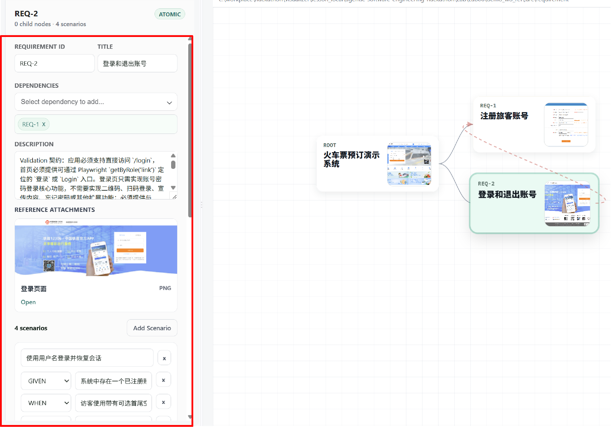
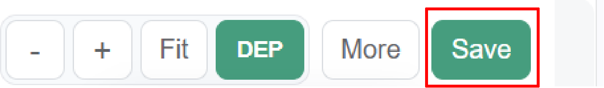
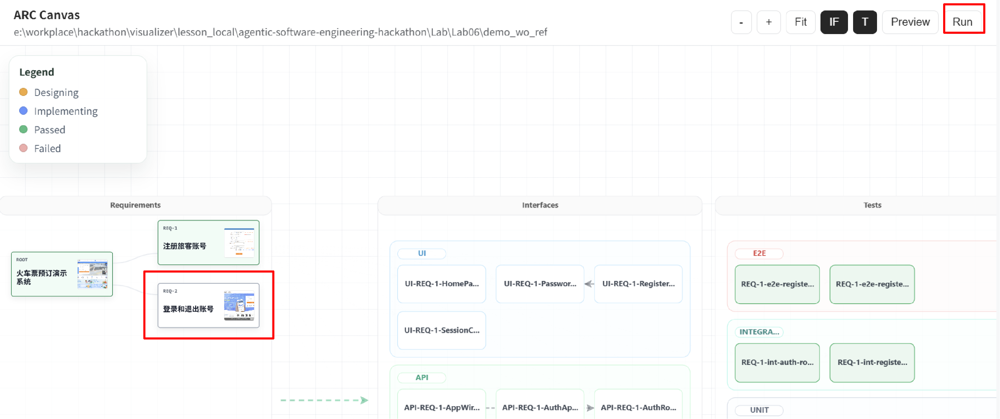

# Lab 6: Incremental Compilation Practice

  <a href="./README.md">中文</a> |
  <a href="./README_en.md">English</a>

## Lab Content

This lab guides you through using incremental requirements in ARC Visualizer to add new features to the compilation result of an existing application and observe how the requirements, Canvas, and generated results change during incremental compilation.

### Lab Materials

This lab continues the environment and workflow from Lab04. The Lab06 directory also provides [`ticket-booking-quickstart-fixed`](./ticket-booking-quickstart-fixed/), which contains the requirements needed for this incremental compilation exercise.

If you want to get started more quickly, you can also reuse the `demo_wo_ref` provided by Lab04 and complete this lab on top of it.

## Lab Steps

### 1. Open the Requirement Editor

Select any requirement node, click the plus button in the left sidebar, and open the `requirement editor` interface.

### 2. Add a Requirement Node

Open `More-Add Children/Sibling` in the upper-right corner and choose whether to add a child node or a sibling node as needed.

For example, you can add a node at the same level as “Registration” and plan it as a “Login” feature.

### 3. Fill In the Requirement Description

Fill in the details of the new requirement. A complete and clear requirement description should generally include:

- Title;
- Dependencies;
- Requirement description;
- One or more `scenarios`.

The description should clearly state the feature goal, its dependencies on existing requirements, and the usage scenarios it must support. This helps ARC generate the corresponding interfaces, tests, and implementation.

### 4. Save the Requirement and Run Incremental Compilation

After editing, click `Save` in the upper-right corner to return to the main Canvas. The Canvas updates automatically. After confirming that the new or modified requirement node is displayed, run `Run`.

ARC Visualizer generates the interfaces, tests, and implementation associated with the added or modified requirements. Observe the compilation process and the node changes on the main Canvas.

### 5. Check the Incremental Compilation Result

After the run completes, check the following:

- Whether the new requirement appears in Canvas;
- Whether interfaces and tests related to the new requirement were generated;
- Whether the generated results were written to the current workspace;
- Whether the new feature can be started and inspected in Preview.

## Key Points

- Incremental compilation should be based on the current workspace and its existing compilation results. Do not accidentally use the workspace from another lab.
- When adding a requirement, provide clear dependencies and usage scenarios.
- Run `Run` only after saving the requirement so that ARC Visualizer reads the latest content.
- At the end of the lab, use Canvas, Traceability, and Preview to check the complete path from the requirement to the implementation.

