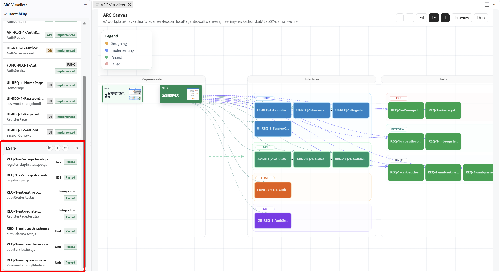
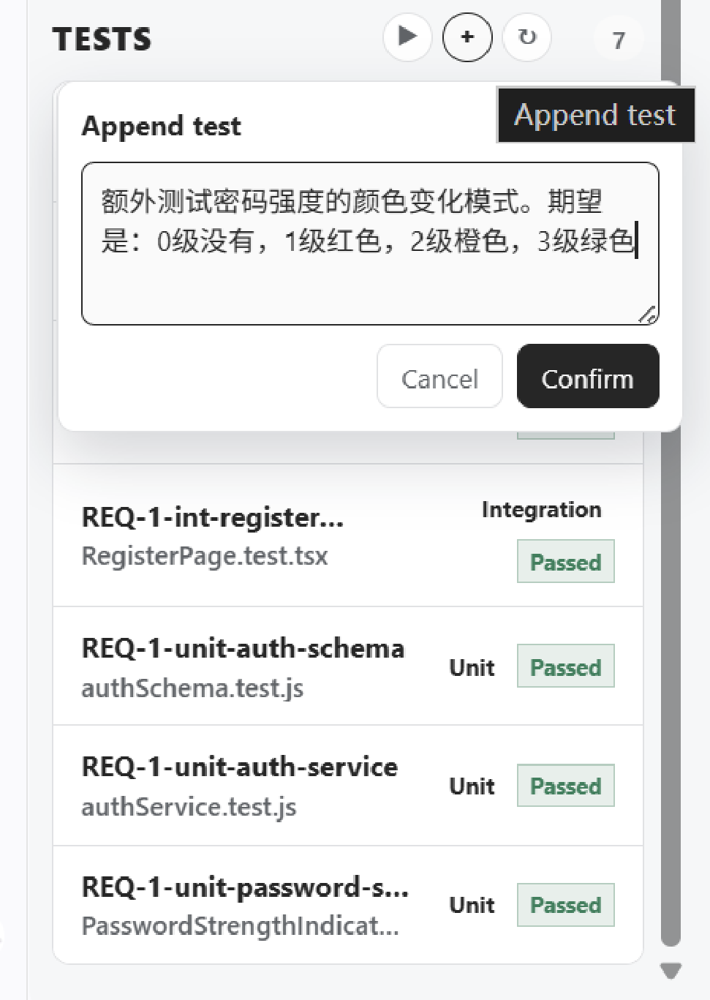
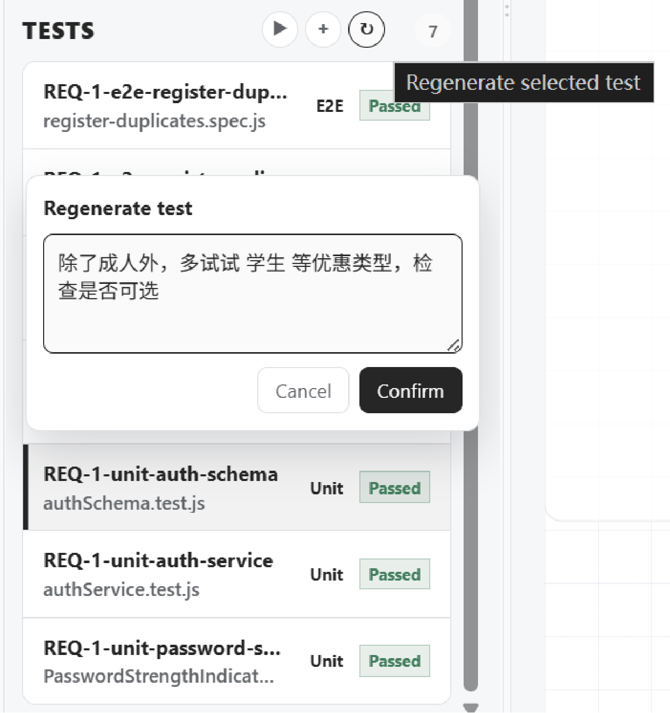
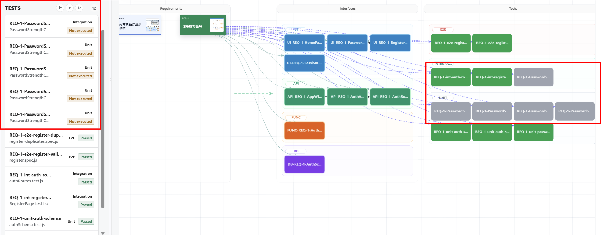
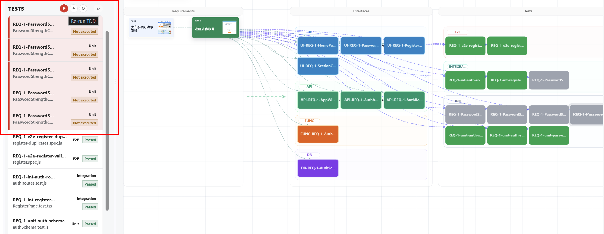
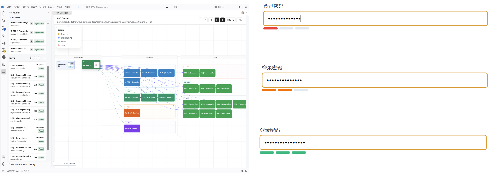

# Lab 7：交互式编译与迭代

  <a href="./README.md">中文</a> |
  <a href="./README_en.md">English</a>

## 实验内容

本实验将引导学员在 ARC Visualizer 中使用交互式编译和迭代功能。你将通过新增或修改测试，以测试驱动的方式让智能体持续迭代软件，实现和完善具体功能细节。

### 实验材料

本实验延续 Lab04 的环境和操作方式。Lab07 目录额外提供了 `demo_added`，作为一次交互式编译成功迭代后的结果参考。

开始实验前，请按照前面实验的说明打开对应的 ARC Visualizer 工作区，并准备好需求和生成结果。

## 实验步骤

### 1. 了解交互式编译工具

ARC Visualizer 提供了一系列用于追加和修改测试内容的工具。你可以通过这些测试，以测试驱动的方式推动智能体继续迭代软件。

### 2. 选择基准需求并新增或修改测试

选中一个基准需求，在该需求下新增或修改测试。

新增测试时，使用新增测试的操作入口：

修改已有测试时，使用修改测试的操作入口：

新增或修改测试时，应确保测试内容准确表达希望实现或验证的功能细节。

### 3. 查看测试生成结果

提交测试变更后，观察 ARC Visualizer 的生成结果。针对刚刚追加的测试，模型可能会生成 5 个新的测试。

实际生成的测试数量和内容可能因需求、当前版本和模型结果而不同，请以界面中显示的结果为准。

### 4. 选择测试并重新迭代

在左侧单击第一个按钮，选中需要重新迭代的测试，然后再次单击该按钮，触发新一轮交互式编译和修复。

观察智能体如何根据测试内容和执行反馈调整软件实现。

### 5. 检查最终结果

等待本轮迭代完成后，查看最终生成结果，并确认新增或修改的测试已经反映到当前版本中。

可以将当前结果与 Lab07 目录中的 `demo_added` 参考结果进行对照，重点观察测试、实现和需求之间的变化。

## 实验要点

- 交互式编译以测试为迭代入口，新增或修改测试后再推动智能体继续工作。
- 测试内容应具体、可执行，并准确表达需要实现的功能细节。
- 每次重新迭代前，应确认选中了正确的需求和测试。
- 实际生成结果可能与示例不同，应以当前工作区和 ARC Visualizer 界面中的结果为准。
